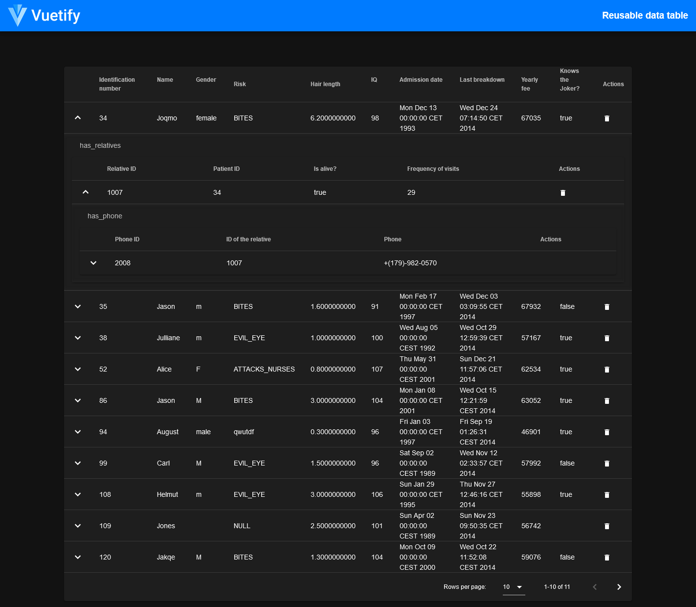

# GraphAware DataTable

A simple wrapper component built with Vite-Vue2-Typescript




## Main project outline

:construction: => (under construction)

    ***Vue-Commerce***

|           *Component name*    |          *Status*          |
|   :-------------------:       |    :------------------:    |
| Wrapper component             |           done ✔️          |
| Nested Tables                 |           done ✔️          |
| Totally recursive             |        :construction:      |
| Everything is Recursive       |        :construction:      |
| Delete functionality          | Parent only :construction: |
---

### Project setup
After cloning this repo, just run the following command:
```
npm install
```

### Compiles and hot-reloads for development
```
npm run dev
```

### Compiles and minifies for production
```
npm run build
```

### Run your tests
```
npm run test
```

