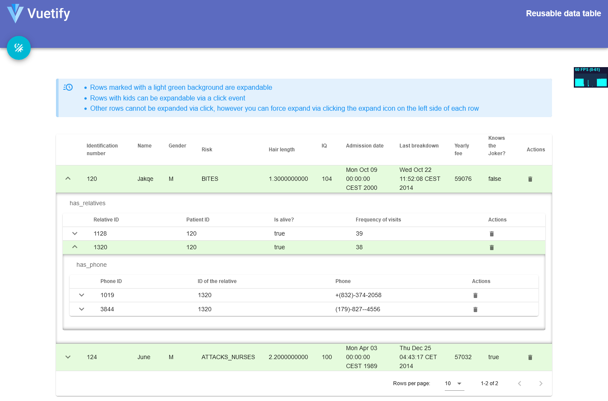
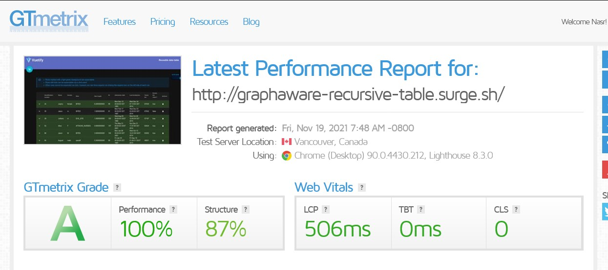

# GraphAware DataTable

A simple wrapper component built with Vite-Vue2-Typescript




---
## [Demo Link here!](http://graphaware-recursive-table.surge.sh/)

---

## Main project outline

### :construction: => (under construction)
### ✔️ => (done)


|         *Component name*      |          *Status*          |
|       :-------------------:   |    :------------------:    |
| Wrapper component             |           done ✔️          |
| Nested Tables                 |           done ✔️          |
| Totally recursive             |           done ✔️          |
| Delete functionality          |           done ✔️          |
---

## lighthouse results


Vite is a powerful baby technology for simple-to-complex && fast development. That's why I chose it for this simple task


## Project setup
After cloning this repo, just run the following command:
```
npm install
```

### Compiles and hot-reloads for development
```
npm run dev
```

### Compiles and minifies for production
```
npm run build
```

### Run your tests
```
npm run test
```

